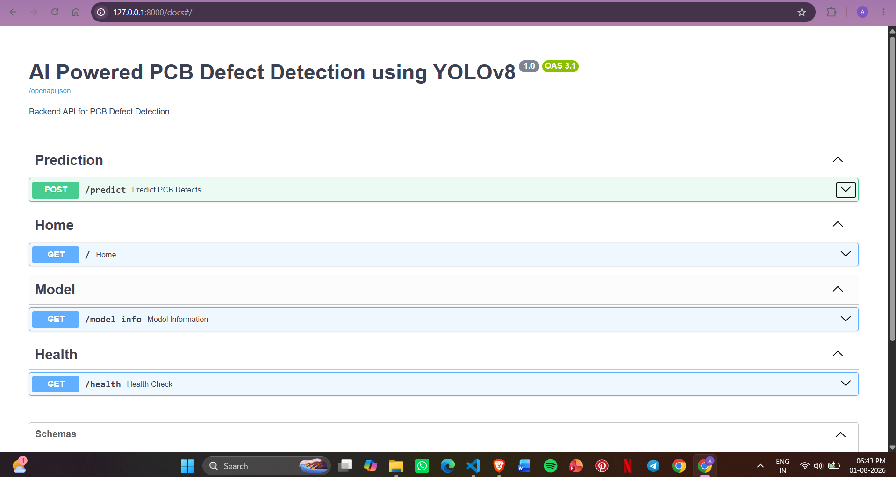
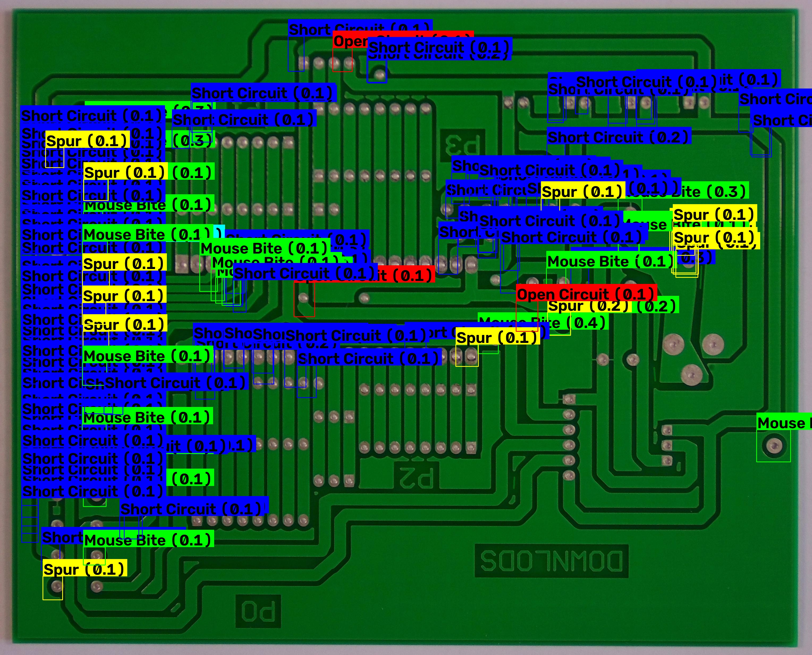
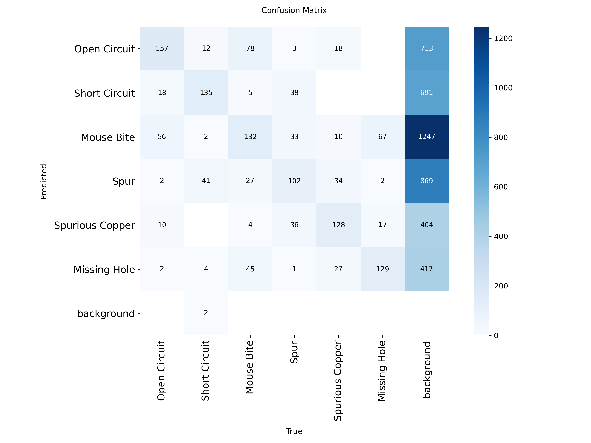

# 🤖 AI Powered PCB Defect Detection using YOLOv8

An AI-powered PCB (Printed Circuit Board) defect detection system that automatically identifies manufacturing defects using a custom-trained YOLOv8 object detection model. The project provides a FastAPI backend for real-time inference and serves annotated detection results through REST APIs.

---

## 📌 Project Overview

This project automates PCB inspection by detecting common manufacturing defects from PCB images using Computer Vision and Deep Learning.

Instead of manual inspection, users can upload a PCB image through the API and receive:

- Detected defect names
- Confidence scores
- Bounding box coordinates
- Annotated result image
- REST API response in JSON format

---

## 🚀 Features

- ✅ YOLOv8 custom-trained object detection model
- ✅ Detection of 6 PCB manufacturing defects
- ✅ FastAPI REST API
- ✅ Interactive Swagger UI
- ✅ Image upload support
- ✅ Automatic annotated image generation
- ✅ Static image serving
- ✅ Model information endpoint
- ✅ Health check endpoint
- ✅ Input validation and error handling

---

## 🔍 Detectable PCB Defects

| Class | Defect |
|--------|---------|
| 0 | Open Circuit |
| 1 | Short Circuit |
| 2 | Mouse Bite |
| 3 | Spur |
| 4 | Spurious Copper |
| 5 | Missing Hole |

---

## 🛠️ Tech Stack

### AI / Computer Vision
- Python
- YOLOv8 (Ultralytics)
- OpenCV
- NumPy
- PyTorch

### Backend
- FastAPI
- Uvicorn
- Python Multipart

### Tools
- VS Code
- Git
- GitHub

---

## 📂 Project Structure

```text
AI-POWERED-PCB-DEFECTS-DETECTION/

├── backend/
│   ├── app.py
│   ├── predictor.py
│   ├── utils.py
│   ├── uploads/
│   └── results/
│
├── dataset/
├── evaluation/
├── frontend/
├── scripts/
├── notebooks/
├── test_images/
├── samples/
├── README.md
└── requirements.txt
```

---

## ⚙️ Installation

### Clone Repository

```bash
git clone https://github.com/anchalsharma08/AI-POWERED-PCB-DEFECTS-DETECTION.git
```

### Navigate to Project

```bash
cd AI-POWERED-PCB-DEFECTS-DETECTION
```

### Create Virtual Environment

```bash
python -m venv venv
```

### Activate Virtual Environment

Windows

```bash
venv\Scripts\activate
```

### Install Dependencies

```bash
pip install -r requirements.txt
```

### Run FastAPI

```bash
uvicorn backend.app:app --reload
```

---

## 📡 API Endpoints

| Method | Endpoint | Description |
|----------|------------|---------------------------|
| GET | `/` | Home |
| POST | `/predict` | Predict PCB defects |
| GET | `/model-info` | Model information |
| GET | `/health` | Health check |

---

## 📷 Sample Output

### API Response

```json
{
    "status": "success",
    "filename": "pcb2.jpg",
    "total_detections": 10,
    "detections": [
        {
            "type": "Short Circuit",
            "confidence": 0.91,
            "bbox": [100,200,300,400]
        }
    ],
    "result_image_url": "http://127.0.0.1:8000/results/pcb2_result.jpg"
}
```

---

## Screenshots

### Swagger UI



### Detection Result



### Evaluation



## 📈 Model Performance

The custom-trained YOLOv8 model achieved excellent performance on the PCB defect dataset.

- High Precision
- High Recall
- High mAP@50
- Robust detection across all six defect classes

Model evaluation results are available in the `evaluation/` directory.

---

## 🔮 Future Improvements

- React Dashboard
- MongoDB Database
- User Authentication
- Detection History
- ESP32-CAM Integration
- Cloud Deployment
- Real-time PCB Inspection

---

## 👨‍💻 Author

**Anchal Sharma**

Electronic Engineering (VLSI Design Technology)

AI • Computer Vision • Full Stack Development

---

## ⭐ If you found this project useful, consider giving it a star.
