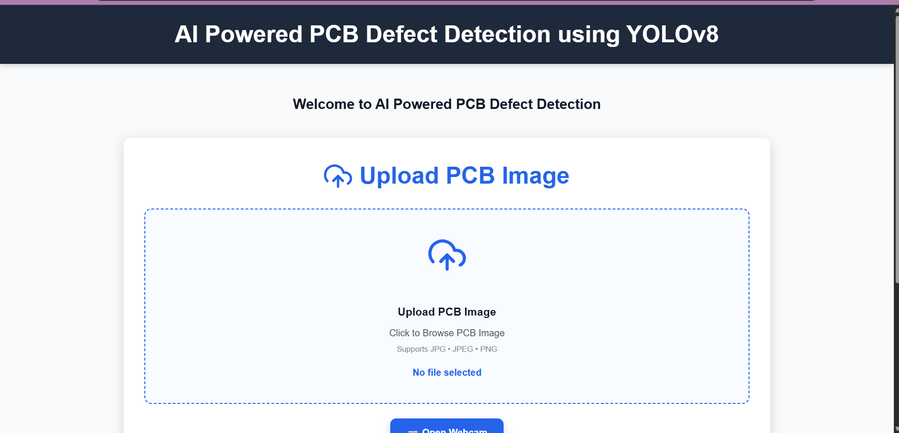
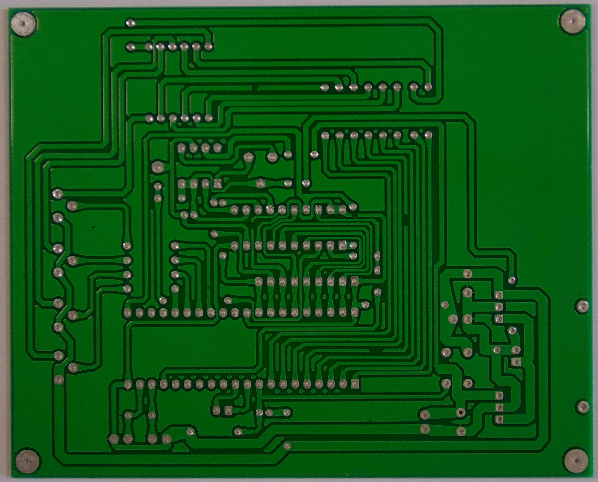
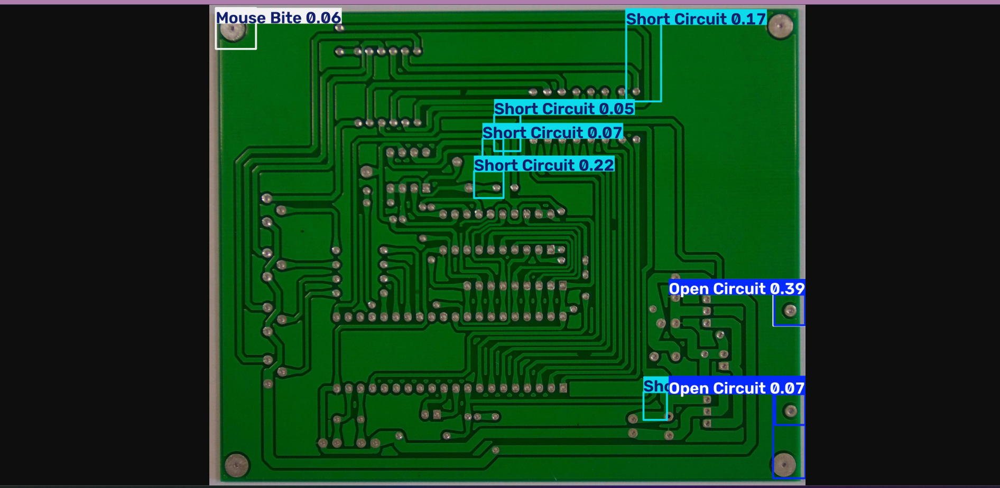
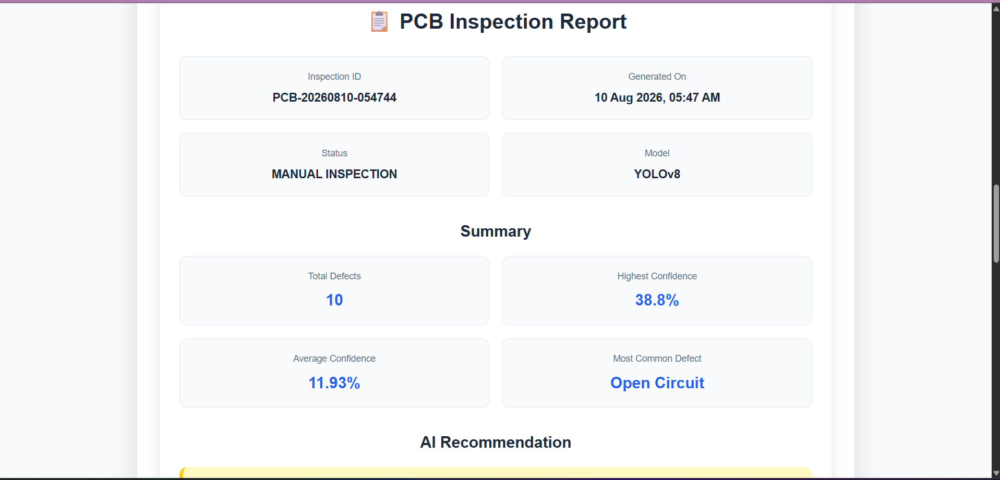
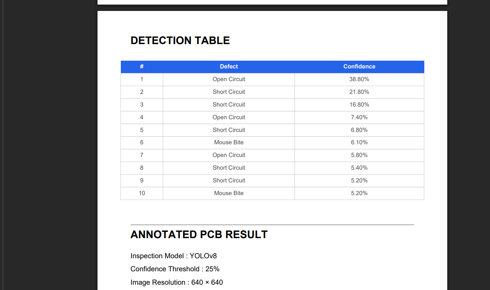

# 🤖 AI-Powered PCB Defect Detection System

> An AI-powered web application for automatic Printed Circuit Board (PCB) defect detection using **YOLOv8**, **FastAPI**, and **React**.


---

## 📌 Project Overview

Printed Circuit Boards (PCBs) are the foundation of modern electronic devices. Manual inspection of PCB defects is time-consuming and prone to human error.

This project presents an **AI-powered PCB Defect Detection System** that automatically detects manufacturing defects using the **YOLOv8 object detection model**. Users can upload a PCB image or capture one using a webcam, and the system identifies defects, generates an inspection report, and exports the results as a professional PDF report.

The application is designed with a modern React frontend and a FastAPI backend, providing a responsive and user-friendly interface for automated PCB inspection.

---

# ✨ Features

- 📤 Upload PCB images for defect inspection
- 📷 Capture PCB images directly using a webcam
- 🤖 AI-powered defect detection using YOLOv8
- 🎯 Detect multiple PCB manufacturing defects simultaneously
- 📊 Display confidence scores for each detected defect
- 📈 Automatic inspection summary and analysis
- 📄 Generate a professional PDF inspection report
- 🖼️ Download annotated detection images
- 📱 Responsive and modern user interface
- ⚡ FastAPI backend for high-performance inference
- 🔄 Analyze multiple PCB images in a single session


---

# 📸 Screenshots

## 🏠 Home Page



---

## 📤 Upload PCB Image



---

## 🔍 Detection Result



---

## 📊 Inspection Report



---

## 📄 Generated PDF Report



---

# 🛠️ Tech Stack

## Frontend

- React.js
- Vite
- CSS3
- Axios
- jsPDF
- React Icons

## Backend

- FastAPI
- Python
- OpenCV
- Pillow
- Uvicorn

## AI / Machine Learning

- YOLOv8
- Ultralytics
- DeepPCB Dataset

## Tools

- Git
- GitHub
- VS Code

---

# ⚙️ System Architecture

```text
                 PCB Image
                      │
          ┌───────────┴───────────┐
          │                       │
     Upload Image           Webcam Capture
          │                       │
          └───────────┬───────────┘
                      │
                 React Frontend
                      │
               HTTP Request (REST API)
                      │
               FastAPI Backend
                      │
            YOLOv8 Object Detection
                      │
      ┌───────────────┼────────────────┐
      │               │                │
Detection Image   AI Analysis   Defect Statistics
      │               │                │
      └───────────────┼────────────────┘
                      │
           Inspection Report Generator
                      │
              Professional PDF Report
```

---

# 📂 Project Structure

```text
AI-POWERED-PCB-DEFECTS-DETECTION/
│
├── backend/
│   ├── app.py
│   ├── predictor.py
│   ├── services/
│   ├── uploads/
│   ├── results/
│   └── requirements.txt
│
├── frontend/
│   ├── public/
│   ├── src/
│   │   ├── components/
│   │   ├── pages/
│   │   ├── services/
│   │   └── styles/
│   ├── package.json
│   └── vite.config.js
│
├── screenshots/
├── README.md
└── LICENSE
```

---

# 🚀 Installation

## 1️⃣ Clone the Repository

```bash
git clone https://github.com/anchalsharma08/AI-POWERED-PCB-DEFECTS-DETECTION.git
```

---

## 2️⃣ Backend Setup

```bash
cd backend

pip install -r requirements.txt

uvicorn app:app --reload
```

---

## 3️⃣ Frontend Setup

```bash
cd frontend

npm install

npm run dev
```

The application will be available at:

Frontend

```
http://localhost:5173
```

Backend

```
http://localhost:8000
```

---

# ▶️ Usage

1. Launch the React frontend.
2. Upload a PCB image or open the webcam to capture one.
3. Click **Analyze PCB**.
4. The AI model detects PCB defects and highlights them with bounding boxes.
5. View the inspection summary and confidence scores.
6. Download the annotated image.
7. Generate a professional PDF inspection report.

---

# 🧠 AI Model

The project uses the **YOLOv8 object detection model** trained on the **DeepPCB dataset** for automatic PCB defect detection.

## Supported Defect Classes

- Open Circuit
- Short Circuit
- Mouse Bite
- Missing Hole
- Spur
- Spurious Copper

The model performs real-time object detection and returns:

- Defect name
- Bounding box
- Confidence score
- Detection image
- Inspection summary

---

# 📄 PDF Inspection Report

The application automatically generates a professional inspection report in PDF format after each PCB analysis.

The report includes:

- Inspection ID
- Date & Time
- PCB Image
- AI Detection Result
- Total Defects
- Defect Distribution
- Confidence Statistics
- AI Recommendation
- Inspection Observations
- Detailed Detection Table
- Footer with project information

This feature enables users to maintain digital inspection records and easily share results.

---

# 🔮 Future Scope

The current version focuses on AI-based PCB defect detection with PDF reporting. Future enhancements include:

- 📡 ESP32-CAM integration for wireless PCB image capture
- 🗄️ SQLite / PostgreSQL database integration
- 📜 Inspection history management
- 🔍 Search and filter previous inspections
- 📊 Interactive analytics dashboard
- 📈 Defect trend visualization
- 🌐 Cloud deployment for remote access
- 🔐 User authentication and role management
- ☁️ Cloud storage for inspection reports
- 🤖 Continuous model improvement with additional datasets

---

# 👨‍💻 Author

**Anchal Sharma**

- 🎓 Electronic Engineering (VLSI Design Technology)
- 🏫 Maharaja Agrasen Institute of Technology (MAIT), Delhi
- 💻 Aspiring Software Developer | AI Enthusiast | Full-Stack Developer

### Connect with Me

- GitHub: https://github.com/anchalsharma08
- LinkedIn:https://www.linkedin.com/in/anchal-sharma-a1151a280/?lipi=urn%3Ali%3Apage%3A

---

# 📜 License

This project is licensed under the **MIT License**.

See the [LICENSE](LICENSE) file for more details.

---

# 🙏 Acknowledgements

This project was developed using the following technologies and resources:

- Ultralytics YOLOv8
- DeepPCB Dataset
- FastAPI
- React.js
- OpenCV
- jsPDF
- GitHub

---

# ⭐ Support

If you found this project useful, consider giving it a **⭐ Star** on GitHub.

Your support motivates further development and future improvements.